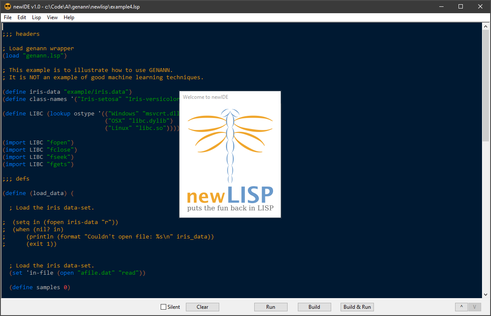
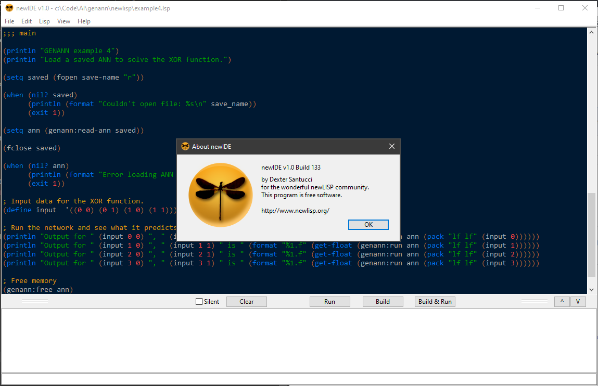
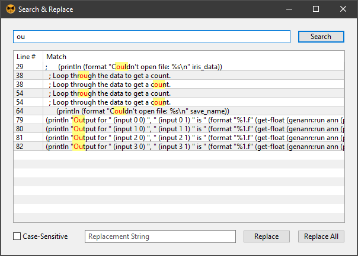
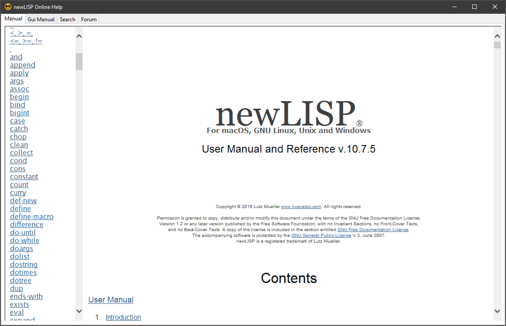
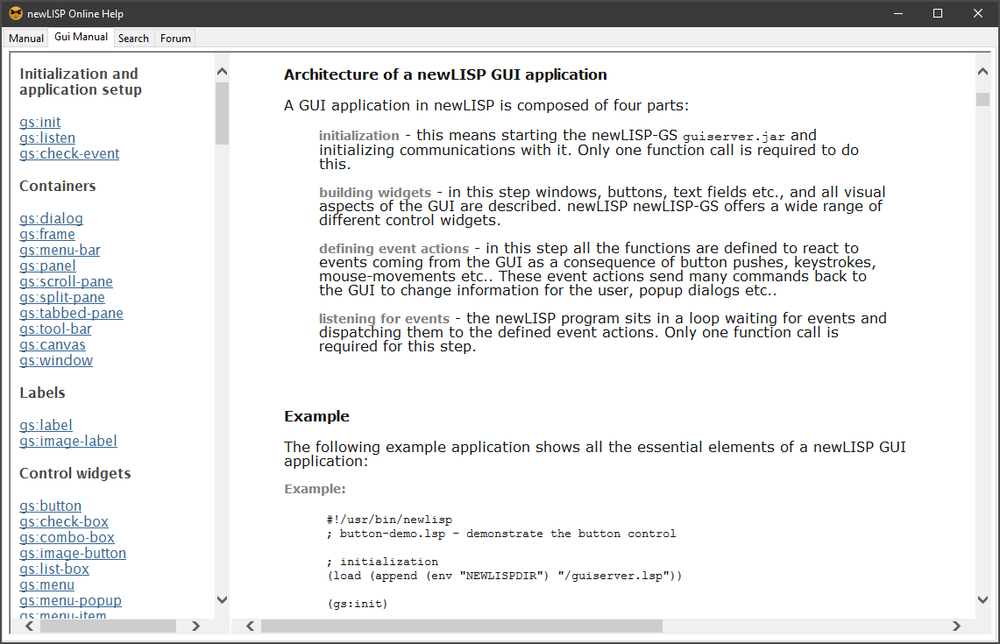
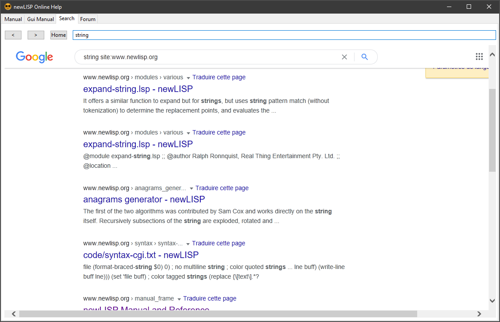
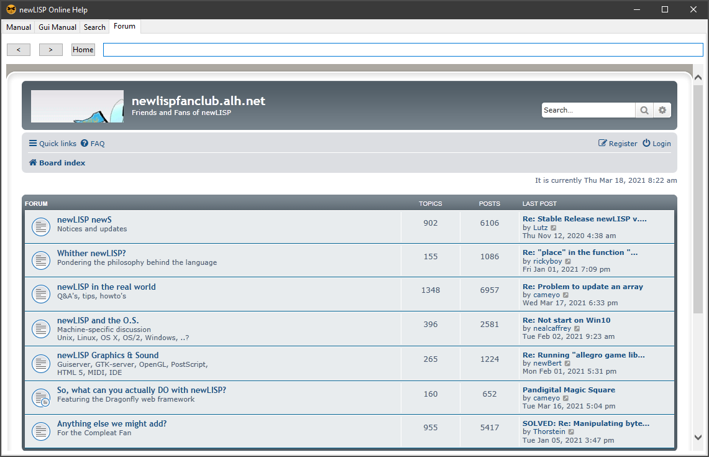

# newIDE
newIDE is an Integrated Development Environment for the newLISP language.

# Downloads

You can <b>download</b> the latest release for <b>Windows</b> and <b>MacOSX</b> [HERE](https://github.com/DexterLagan/newIDE/releases).

# Features

The <b>Editor</b> lets one create and edit newLISP source files (.lsp). There is an integrated REPL which uses the bundled newLISP module to interactively evaluate newLISP code. One can also build the currently loaded source code into a standalone binary, and run it in one click:

The <b>Search & Replace</b> dialog is an advanced replacement tool, which displays matching lines and highlights the pattern. You can selectively replace the pattern in all or only selected lines:

The <b>Online Help</b> window displays the newLISP manual in an integrated browser:

The <b>GUI Manual</b> displays the newLISP GUI module manual in a separate tab:

The <b>Online Search</b> tab searches the newLISP Web site for any search pattern:

The <b>Forum</b> tab opens the newLISP forum in an integrated browser:

Cheers,

Dexter
